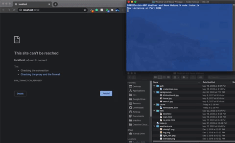

# Weather-and-News-WebApp
- This program asks a user for their city and returns back a page with the current weather, an icon of the weather and the top news from that day. The APIs used are OpenWeather's API and Google News, If the user enters an invalid city, the website will display an error msg prompting the user to input a valid city. The website searches for through the cache file based on the current inputted city and if they were inputted on the same day.

To use the program: 
- clone it on your local machine 
- *IMPORTANT* Go on openweather.com and googlenews.com and get API keys. Add them to the "credentials.JSON" file.
- open your terminal and navigate to the project directory
- run “node index.js”
- open your preferred browser and go to http://localhost:3000 

